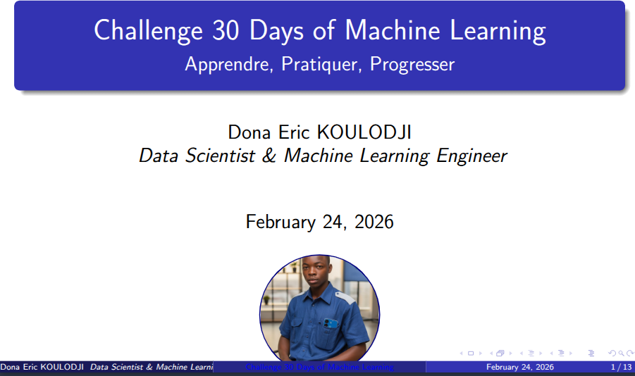

# CHALLENGE 30 DAYS OF MACHINE LEARNING

Le challenge 30 Jours days of Machine Learning consiste en un premier temps à découvrir et comprendre les mathématiques théoriques qui se cachent derrière les modèles ou algorithme de machine learning que nous utilisons et implémentons au quotidien. Dans un second temps, ce challenge est de permettre aux passionnées de la **data, machine learning et intelligence artificielle** d'**apprendre**, de **savoir implémenter** et d'approfondir ses connaissances. Parceque tout tourne autour des mathématiques.

## 1- Objectifs :

Le but du challenge est de vous faire:

   **- Découvrir la théorie des mathématiques derrière les algorithmes de Machine Learning ou d'IA** ;

   **- Les applications du Machine Learning et d'IA dans la vie réelle**

   **- Permettre à la communauté ML-IA d'avoir un portfolio de projets concrets, réels et demontrables de vos compétences**

   **- d'Appliquer sur des projects réels que nous rencontrons dans la vie réelle**

## 2- Programmes du Challenge 

Chaque jour suit la logique : **Théorie Mathématique --> Implémentation From Scratch (Numpy) --> Projet Appliqué.**

### 🟢 Semaine 1 : Fondations et Régressions (Prédire des Valeurs)

L'objectif est de maîtriser l'optimisation et la linéarité.

* **Jour 1 : Algèbre Linéaire & Calcul.** 

*Projet :* Créer un moteur de transformation d'images (rotation/scaling) via matrices.

* **Jour 2 : Descente de Gradient.** 

*Projet :* Trouver le minimum d'une fonction complexe (Visualisation 3D de la convergence).

* **Jour 3 : Régression Linéaire Simple.** 

*Projet :* Prédire le prix des loyers basé sur la surface (Données réelles).

* **Jour 4 : Régression Linéaire Multiple.** 

*Projet :* Analyse de l'impact du marketing multi-canal sur les ventes.

* **Jour 5 : Régularisation (Ridge & Lasso).** 

*Projet :* Prédire le prix des maisons (Dataset Boston/Ames) en évitant l'overfitting.

* **Jour 6 : Régression Logistique (Binaire).** 

*Projet :* Détection de spams dans des messages SMS.

* **Jour 7 : Softmax Regression (Multi-classe).** 

*Projet :* Classification de types de fleurs (Iris Dataset).

---

### 🔵 Semaine 2 : Arbres et Méthodes d'Ensemble (La Puissance du Non-Linéaire)

Focus sur l'Entropie et le Gain d'Information.

* **Jour 8 : Decision Trees (ID3/CART).** 

*Projet :* Système d'approbation automatique de prêt bancaire.

* **Jour 9 : Élagage des arbres (Pruning).** 

*Projet :* Optimisation de l'arbre du Jour 8 pour la généralisation.

* **Jour 10 : Bagging & Random Forest.** 

*Projet :* Prédiction du désabonnement client (Churn) en télécom.

* **Jour 11 : Boosting (AdaBoost).** 

*Projet :* Détection de visages (méthode simplifiée de Viola-Jones).

* **Jour 12 : Gradient Boosting (GBM).**

*Projet :* Prédiction de la demande d'électricité.

* **Jour 13 : XGBoost & LightGBM.** 

*Projet :* Compétition Kaggle simplifiée sur les prix des voitures d'occasion.

* **Jour 14 : Feature Importance & SHAP & LIME.**

*Projet :* Expliquer pourquoi le modèle du Jour 13 a pris telle décision.

---

### 🟡 Semaine 3 : Géométrie et Probabilités (SVM, KNN et Bayes)

* **Jour 15 : k-Nearest Neighbors (KNN).** 

*Projet :* Système de recommandation de films simple (similarité de genre).

* **Jour 16 : Support Vector Machines (Linéaire).** 

*Projet :* Classification de cellules cancéreuses (Bénigne vs Maligne).

* **Jour 17 : SVM & Kernel Trick.** 

*Projet :* Séparation de données circulaires (Non-linéaires).

* **Jour 18 : Naive Bayes.** 

*Projet :* Analyse de sentiment sur des tweets (Positif vs Négatif).

* **Jour 19 : Gaussian Mixture Models (GMM).** 

*Projet :* Segmentation de clients par comportement d'achat.

* **Jour 20 : Analyse Discriminante Linéaire (LDA).** 

*Projet :* Réduction de dimension pour la reconnaissance faciale.

* **Jour 21 : Évaluation de Modèle (ROC, AUC, F1).** 

*Projet :* Dashboard de performance pour tous les modèles précédents.

---
### 🔴 Semaine 4 : Apprentissage Non-Supervisé et Deep Learning

* **Jour 22 : K-Means Clustering.** 

*Projet :* Compression d'image en réduisant le nombre de couleurs.

* **Jour 23 : Hierarchical Clustering.**

 *Projet :* Création d'un Arbre Généalogique de types de chansons (Spotify data).

* **Jour 24 : PCA (Principal Component Analysis).** 

*Projet :* Visualisation 2D d'un dataset à 50 dimensions.

* **Jour 25 : t-SNE & UMAP.** 

*Projet :* Cartographie visuelle des chiffres manuscrits (MNIST).

* **Jour 26 : Le Perceptron.** 

*Projet :* Modélisation de portes logiques (AND/OR).

* **Jour 27 : Multi-Layer Perceptron (MLP).** 

*Projet :* Reconnaissance de chiffres manuscrits (MNIST) From Scratch.

* **Jour 28 : Backpropagation & Chain Rule.** 

*Projet :* Codage manuel de l'algorithme de mise à jour des poids.

* **Jour 29 : Optimiseurs (Adam, RMSProp).** 

*Projet :* Comparaison de la vitesse d'apprentissage sur un dataset de classification.

* **Jour 30 : Déploiement & Synthèse.**

 *Projet :* Créer une API avec FastAPI pour l'un des modèles et le pousser sur GitHub.

**FIN OF CHALLENGE 30 DAYS OF MACHINE LEARNING**

---

# BONUS

Pour aller au bout du challenge,nous allons déployer ensemble un des modèles de Machine Learning en production. 

De ce fait nous apprendrons ensemble comment :

* **Déployer un modèle de Machine Learning via FastAPI**

* **Créer un mini site web **Streamlit | Render** pour la production**

---

## STACKS TECHNIQUES À UTILISER

* **Python 3.13 | Other Version**

* **Git & Github | Gitlab**
* **Numpy, Pandas, Matplotlib, Seaborn, LIME & SHAP**
* **Streamlit** (Latest version)
* **Sklearn** (Bibliothèque de Machine Learning)
* **Jupyter | Anaconda**
* **FastAPI** (Librairie Python pour créer une **API**)

## AUTEURS

* ***Nom & Prenoms :*** **Eric KOULODJI**

* ***Profil :*** **Data Scientist, Machine Learning Engineer**

### **Founder of DTech-Africa**

*La Mathématique n'est pas un luxe, elle est la preuve vivante de notre existence sur Terre.* 

### CONTACTS

* **Linkedin:** https://www.linkedin.com/in/dona-erick

* **Youtube :** 

* **Facebook :** https://facebook.com/dona.eric.koulodji

* **Medium :** https://medium.com/@koulojiric

* **Github :** https://github.com/dona-eric 

UNE SEULE ACTION : 

***Abonnez-vous***

***Follow-me***

***Share***

                 Fait le 24 Février 2026# 30 Days ML Math Challenge
Mon dépôt pour le challenge de 30 jours sur les mathématiques du Machine Learning.
